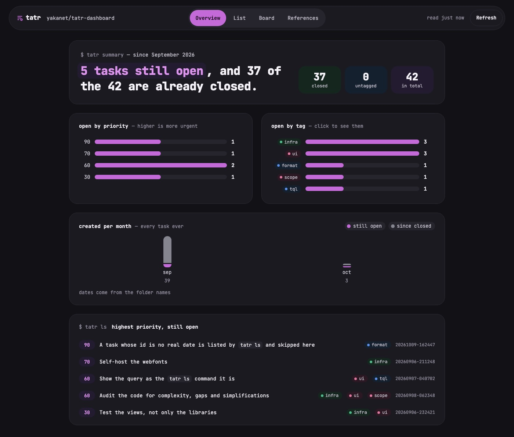
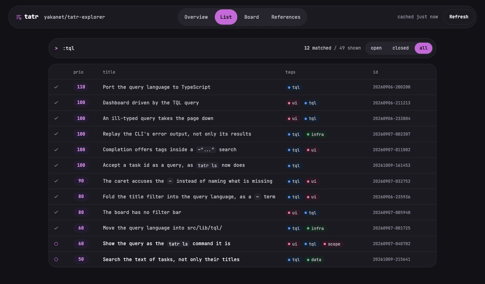
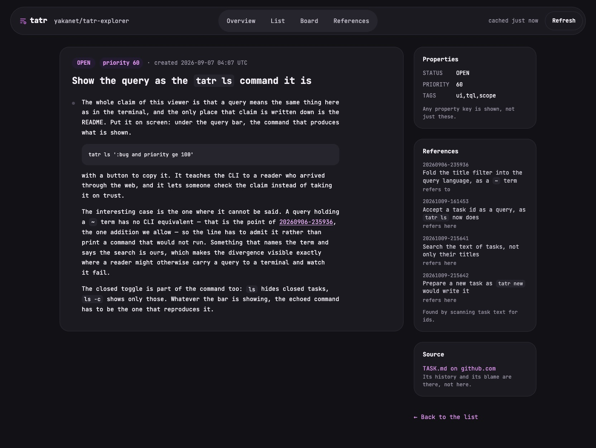

<div align="center">

# tatr dashboard

**Any repository's `tasks/` folder, read like an issue tracker.**<br>
In the browser. No server, no backend, no clone.

[**Open it →**](https://github.broutin.dev/tatr-dashboard) &nbsp;·&nbsp;
[Watch it read its own backlog](https://github.broutin.dev/tatr-dashboard/yakanet/tatr-dashboard) &nbsp;·&nbsp;
[What is tatr?](https://github.com/tsoding/tatr)

[](https://github.com/yakanet/tatr-dashboard/actions/workflows/deploy.yml)

</div>



<div align="center"><sub>Reading <a href="https://github.com/tsoding/tatr"><code>tsoding/tatr</code></a>, the repository the test fixtures are taken from.</sub></div>

## Your tasks already live in git. Now you can see them.

[tatr](https://github.com/tsoding/tatr) keeps every task as a folder —
`tasks/20260315-160715/TASK.md` — holding a few `- KEY: value` lines and
free-form Markdown. It is a genuinely good idea: no database, no lock file,
tasks move with the branch, and a change to one shows up in a diff.

It stops being enough the moment somebody asks _what is actually left?_

Paste a repository name. That is the entire setup.

## Every view is a link

The repository _is_ the route, so anything you are looking at can be sent to
someone else and land them exactly there.

| URL                                            | Shows                                                 |
| ---------------------------------------------- | ----------------------------------------------------- |
| `/yakanet/tatr-dashboard`                      | the dashboard for `github.com/yakanet/tatr-dashboard` |
| `/yakanet/tatr-dashboard@main`                 | the same repository, pinned to a branch by name       |
| `/yakanet/tatr-dashboard/list?q=:ui`           | the task list, filtered                               |
| `/yakanet/tatr-dashboard/task/20260906-211234` | one task, rendered                                    |
| `/yakanet/tatr-dashboard/board`                | backlog, in progress, done                            |
| `/yakanet/tatr-dashboard/graph`                | which tasks cite which                                |

Nothing to sign in to, nothing to configure, no repository to register first.

Inside a task, the ids it cites are links too, in its title as in its body —
the ones this repository has, which the References panel lists; an id belonging
to somebody else's tracker stays text.

It answers the keyboard throughout: `j`/`k` walk whatever the view is showing —
rows, bars, graph nodes — `g g` and `G` reach the ends, `/` puts the caret in
the query, `1`-`4` switch view, and `?` lists the rest.

## The query language you already know

The search box speaks TQL — the grammar `tatr ls` accepts. Copy a query out of
your shell history, paste it in, get the same answer.

| Query                              | Matches                                   |
| ---------------------------------- | ----------------------------------------- |
| `:ui`                              | tasks tagged `ui`                         |
| `not :scope`                       | everything nobody is working on right now |
| `priority ge 90`                   | what deserves attention                   |
| `[:ui or :tql] and priority ge 90` | brackets group, so no shell quoting       |
| `tagged`                           | tasks carrying at least one tag           |
| `20260828-211200`                  | the one task with that id                 |
| `~"query language"`                | titles holding every one of those words   |
| `any`                              | everything                                |

Comparisons are spelled as words (`lt le gt ge eq ne`) and square brackets
replace parentheses — that is how a query survives a shell without quoting. The
parser is typed: `and`/`or`/`not` take booleans, comparisons take integers, and
a mistake is pointed at _the offending token_ instead of being silently coerced.
Tag names and keywords complete as you type, with what each tag means alongside
it — the repository's own vocabulary, which nothing else on screen lists.

**One addition of our own: `~` searches titles**, and the CLI has no notion of
it. The divergence is deliberate and it runs one way only — every query `tatr
ls` accepts behaves identically here, but a query written with `~` will not run
there. A reader in a browser has no `grep` sitting beside the tool, and the
alternative was a second search box next to the language, which read as two
unrelated ways to say one thing. `~` rather than a bare quoted string because
the match is loose — every word, in any order, case ignored — and quotes promise
a phrase everywhere else; with `~` carrying that meaning, quotes are left
grouping words that contain spaces and nothing more.



## Nothing to sign up for. Nothing to hand over.

There is no account, no cookie, no analytics, no telemetry — there is no
_server_. The site is a folder of static files, and everything it knows about a
repository it learned in your browser, seconds ago.

- **No sign-in, no token, no permissions to grant.** It reads public
  repositories the way anyone with a browser can.
- **What you read stays yours.** The repositories you open, the queries you
  type, the tasks you follow: none of it is sent anywhere, because there is
  nowhere to send it.
- **The cache is yours too.** Task metadata is kept in your own browser's
  IndexedDB and re-read only when _you_ press Refresh — never on a timer behind
  your back. Clear your site data and it is gone, completely.
- **Only metadata is kept.** Descriptions are more than half the bytes and cost
  nothing to fetch again, so they are never written down at all.

And it is careful with the one budget it does spend on your behalf. GitHub
allows an unauthenticated browser 60 requests an hour, shared with everyone
behind the same IP address, so:

- **One request lists a whole repository.** `git/trees/HEAD?recursive=1` returns
  the entire tree in a single call, and asking for `HEAD` skips the extra
  round-trip that would resolve the default branch by name — including on
  repositories that still call it `master`.
- **Contents come from a CDN.** `raw.githubusercontent.com` does not count
  against the API quota at all.
- **A spent budget gets one more chance.** The page asks `ungh.cc`, which
  proxies the same API with its own credentials, before giving up. One mirror,
  not a chain of them: it is the only request this site makes to anyone but
  GitHub, it carries nothing but the repository name, and it happens only once
  the budget is gone.
- **A refresh that fails costs you nothing.** The reading you were looking at
  stays on screen and the header says it was not renewed, rather than trading a
  true copy for an error page.

Beyond those, the only third-party request is the webfont stylesheet, and
bringing it in-house is
[task `20260906-211248`](https://github.broutin.dev/tatr-dashboard/yakanet/tatr-dashboard/task/20260906-211248).

## Or a folder on your own machine

The one repository a public URL cannot reach is the one you are working in.
**Open a folder** instead, and the browser reads it where it sits — private,
unpushed, offline, whatever is checked out right now, including the task you
have not committed yet.

Nothing is uploaded, and nothing could be: the page has no server to upload to.
Your browser grants access to that one folder, for as long as the tab is open,
and takes it back when you reload — so a local folder is a session rather than
an address, and `/local` is a marker rather than a link anyone else could
follow. The branch comes from `.git/HEAD`, which is a file like any other; the
`tasks/` folder is all that is read.

**Or drag the folder onto the page**, which is the widest door of the three: the
API behind a drop exists in every browser, and on Chromium a dropped folder even
arrives as a handle — the good kind of source.

Because that is what separates the three ways in. A handle can be walked again,
so **Refresh** rereads the folder and a task you closed in your editor shows up
closed; a handle comes from a drop or from the File System Access API, which is
Chromium today and which Brave ships turned off. The directory input, everywhere
else, hands over one snapshot, and refreshing means picking again — which the
button says instead of pretending.

Two of the three ask your permission, and they ask differently — so the page
says which one is coming before you click. The picker asks for access to that
one folder. The directory input asks by the _file count_, because it cannot know
that this page will not upload what it is given: a whole checkout produces
_"import 7,775 files?"_, most of which is `node_modules`, and all but the
`tasks/` folder is discarded on arrival. Picking `tasks/` directly is accepted
for exactly that reason, and costs only the branch name, which lives in
`.git/HEAD` one level up. A drop asks nothing, the drop being the gesture
itself.

Whichever door it came through, a folder with no tasks in it is told so rather
than trawled: the reader picked a folder, and the page can see in one look
whether it holds task folders.

## Identical to the CLI — and that claim is tested

The format parser, the query language and the reference graph are ported from
the C source, not from the README, which simplifies. All three are covered by
**differential tests that replay the real `tatr` binary's output**:

- **79 rows** of `tatr ls` over the 79 tasks of `tsoding/tatr`, compared field
  by field;
- **50 query invocations**, each compared against the exact set of tasks the CLI
  printed;
- **15 invalid queries**, each compared against everything the CLI printed —
  the help, the caret and the message;
- **36 arrows** of `tatr graph`, compared one by one.

A divergence fails the suite. When upstream moves, the recordings are made
again from a single commit, and they earn it: the last time, they caught an
arrow `tatr graph` draws from an id cited only in a title, which this viewer had
missed.

The same discipline governs what reaches the screen: repository content is shown
**verbatim**, typos and straight quotes included, because polishing it would
show a screen the product cannot produce.

Those recordings carry upstream's own task text, which makes them the one thing
in this repository that is not MIT — see [`NOTICE`](NOTICE). No code from tatr is
copied here; the viewer is an independent implementation of the same format.



## Built with

|                 |                                                      |
| --------------- | ---------------------------------------------------- |
| Framework       | SvelteKit 3 (release candidate), Svelte 5 runes      |
| Build           | Vite 8, `adapter-static`, prerendered to plain files |
| Markdown        | markdown-it                                          |
| Tests           | Vitest                                               |
| Package manager | pnpm, pinned                                         |

## Run it

```sh
pnpm install
pnpm run dev
```

```sh
pnpm run check                            # svelte-check, kept at zero errors
pnpm test                                 # the full suite
BASE_PATH=/tatr-dashboard pnpm run build  # what CI builds
```

Deploying is a push to `main`: the workflow type-checks, runs the tests, builds
with the repository name as `BASE_PATH` and publishes to GitHub Pages.
Client-side routing at any path depth works because the build emits a `404.html`
fallback.

## It tracks itself

This repository keeps its own work in its own `tasks/` folder, in the tatr
format — which is why every example above is a live URL. Open
[`/yakanet/tatr-dashboard`](https://github.broutin.dev/tatr-dashboard/yakanet/tatr-dashboard)
and you are reading the backlog of the thing you are reading it with. Its tags
are documented in `tasks/tags`, exactly as tatr expects:

```
scope , currently working on
format , parsing the tatr file format itself
data , fetching and caching repository contents
tql , the query language
ui , screens, interaction and styling
infra , build, deploy and tooling
```

What comes next is not listed here, where it would go stale. It is
[whatever is open](https://github.broutin.dev/tatr-dashboard/yakanet/tatr-dashboard/list),
highest priority first.

## Credits

The format, the CLI and the query language are [tsoding's](https://github.com/tsoding/tatr).
This is a reader for them, nothing more.

MIT licensed — see [LICENSE](LICENSE).
